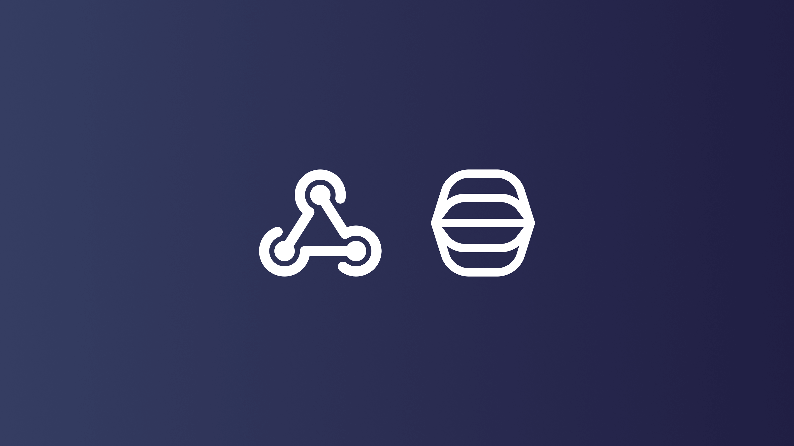
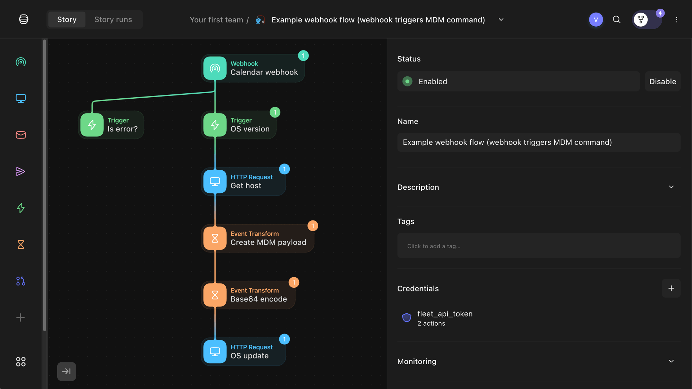
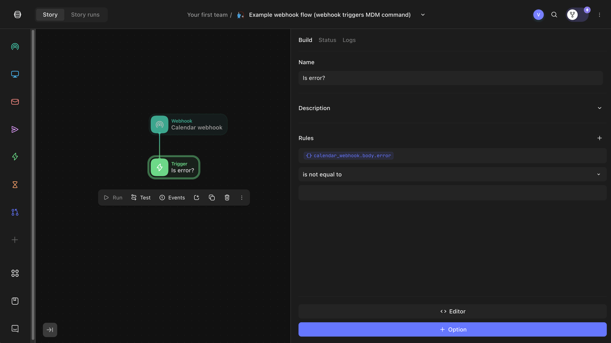
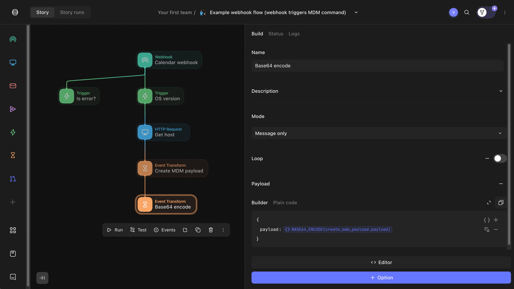

# Building webhook flows with Fleet and Tines



For IT Admins, coordinating necessary actions with users is crucial for maintaining system security and performance. However, managing these actions across numerous devices can be a daunting task. That's where automation tools like Tines and Fleet come into play. In our latest blog post, [Fleet in Your Calendar: Introducing Maintenance Windows](https://fleetdm.com/announcements/fleet-in-your-calendar-introducing-maintenance-windows), we introduced a new feature that allows you to schedule maintenance windows directly in your users' calendar. This feature helps in planning necessary actions and ensures minimal disruption to end users.

Building on that, this guide will walk you through setting up an automated workflow using webhooks and Tines. Maintenance windows call the webhook and initiate the workflow we are building here at the beginning of the calendar event for the user. Tines serves as the low-code/no-code environment for this example, but this workflow can be adapted to any low-code/no-code environment that supports webhooks.

We will demonstrate how to receive a webhook callback from Fleet when a policy is failing on a device and automatically send an MDM command to address the issue. In this example, we'll use a policy for OS version as an illustration, but the same approach can be used for any policy or remote action you need to coordinate with users. By the end of this tutorial, you'll have a fully automated process that leverages the power of Tines to coordinate necessary actions with your users seamlessly.

Let's dive in and see how you can enhance your IT operations with this powerful integration.





## What is a webhook?

A webhook is a custom HTTP callback that allows one application to send data to another in real-time. It is a simple way to trigger an action based on an event.


## What is Tines?

[Tines](https://www.tines.io/) is a no-code automation platform for repetitive tasks. It is a powerful tool for automating workflows, such as sending emails, creating tickets, and updating databases.


## Our example IT workflow

In this example, when a policy is failing on a device, Tines receives a webhook callback from Fleet and using information from the webhook, builds and sends an MDM (Mobile Device Management) command to address the issue. For illustration purposes, we'll use a policy related to OS version, but the same approach can be applied to any policy or remote action.

Fleet will send a callback via its calendar integration feature, a maintenance window. Fleet places a scheduled maintenance event on the device user's calendar. This event informs the device owner that an action needs to be taken during the scheduled time. During the calendar event time, Fleet sends a webhook. The IT admin must set up a flow to handle the necessary action. This article is an example of one such flow.


## Getting started – webhook action

First, we create a new Tines story. A story is a sequence of actions that are executed in order. Next, we add a webhook action to the story. The webhook action listens for incoming webhooks. The webhook will contain a JSON body.


_Tines webhook action._


## Handling errors

Webhooks may often contain error messages if there is an issue with the configuration, flow, etc. In this example, we add a trigger action that checks whether the webhook body contains an error. Specifically, our action checks whether the webhook body contains a non-empty “error” field.




_Tines trigger action checking for an error._

We leave this error-handling portion of the story as a stub. In the future, we can expand it by sending an email or triggering other actions.


## Checking the webhook payload for failing policies

At the same time, we also check what policy triggered the webhook. From previous testing, we know that the webhook payload will look like this:

```json
{
 "timestamp": "2024-03-28T13:57:31.668954-05:00",
 "host_id": 11058,
 "host_display_name": "Victor's Virtual Machine",
 "host_serial_number": "Z5C4L7GKY0",
 "failing_policies": [
   {
     "id": 479,
     "name": "macOS - OS version up to date"
   }
 ]
}
```

The payload contains: 


* The device’s ID (host ID).
* Display name.
* Serial number. 
* A list of failing policies.

We are interested in the failing policies. For this example, we'll look for a policy named "macOS - OS version up to date," but you could adapt this to check for any policy relevant to your needs. We create a trigger that looks for this specific policy.


_Tines trigger action checking for a specific policy._

We use the following formula, which loops over all policies and will only allow the workflow to proceed if true:

```sql
IF(FIND(calendar_webhook.body.failing_policies, LAMBDA(item, item.name = "macOS - OS version up to date")).id > 0, TRUE)
```

## Getting device details from Fleet

Next, we need to get more details about the device from Fleet. Devices are called hosts in Fleet. We add an “HTTP Request” action to the story. The action makes a GET request to the Fleet API to get the device details. We use the host ID from the webhook payload. We are looking for the device’s UUID, which we need to send the OS update MDM command.


_Tines HTTP Request action to get Fleet device details._

To access Fleet’s API, we need to provide an API key. We store the API key as a CREDENTIAL in the current story. The API key should belong to an API-only user in Fleet so that the key does not reset when the user logs out.


_Add credential to Tines story._


## Creating MDM command payload for our example action

Now that we have the device's UUID, we can create the MDM payload. For this example, we'll use a command related to OS updates, but you could adapt this to any MDM command relevant to your needs. We use the [ScheduleOSUpdate](https://developer.apple.com/documentation/devicemanagement/schedule_an_os_update?language=objc) command from Apple's MDM protocol as an illustration.

```xml
<?xml version="1.0" encoding="UTF-8"?>
<!DOCTYPE plist PUBLIC "-//Apple//DTD PLIST 1.0//EN" "http://www.apple.com/DTDs/PropertyList-1.0.dtd">
<plist version="1.0">
<dict>
   <key>Command</key>
   <dict>
       <key>RequestType</key>
       <string>ScheduleOSUpdate</string>
       <key>Updates</key>
       <array>
           <dict>
               <key>InstallAction</key>
               <string>InstallASAP</string>
               <key>ProductVersion</key>
               <string>14.5</string>
           </dict>
       </array>
   </dict>
   <key>CommandUUID</key>
   <string><<UUID()>></string>
</dict>
</plist>
```

This example command would download macOS 14.5, install it, and pop up a 60-second countdown dialog box before restarting the device. Note that the `<<UUID()>>` Tines function creates a unique UUID for this MDM command. Remember, this is just an example - you would adapt the command to whatever action you need to perform.


_Tines event to create an MDM command._

The Fleet API requires the command to be sent as a base64-encoded string. We add a “Base64 Encode” action to the story to encode the XML payload. It uses the Tines `BASE64_ENCODE` function.





_Tines Base64 Encode event._


## Run the MDM command on the device

Finally, we send the MDM command to the device. We add another “HTTP Request” action to the story. The action makes a POST request to the Fleet API to send the MDM command to the device.


_Tines HTTP Request action to run MDM command on the device._

The MDM command will run on the device, performing the action you've specified.


_Example of a macOS notification._


## Conclusion

In this article, we built a webhook flow with Tines. We received a webhook callback from Fleet when a policy was failing on a device. We then sent an MDM command to address the issue. While we used an OS version policy as an example, this same approach can be used for any policy or remote action you need to coordinate with your users. This example demonstrates how Tines can automate workflows and tasks in IT environments, making it easier to coordinate necessary actions with your users through scheduled maintenance windows.


<meta name="articleTitle" value="Building webhook flows with Fleet and Tines">
<meta name="authorFullName" value="Victor Lyuboslavsky">
<meta name="authorGitHubUsername" value="getvictor">
<meta name="category" value="guides">
<meta name="publishedOn" value="2024-05-30">
<meta name="articleImageUrl" value="../website/assets/images/articles/building-webhook-flows-with-fleet-and-tines-1600x900@2x.png">
<meta name="description" value="A guide to workflows using Tines and Fleet via webhook to coordinate necessary actions with users through scheduled maintenance windows.">
